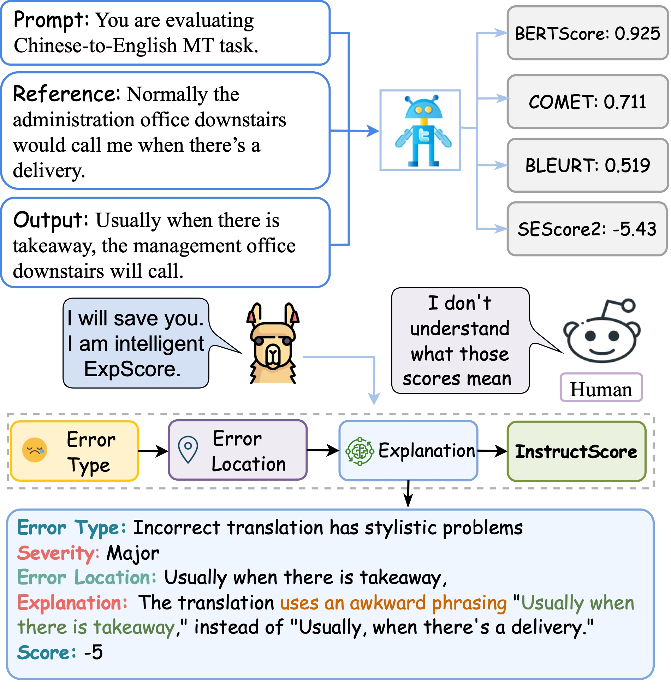
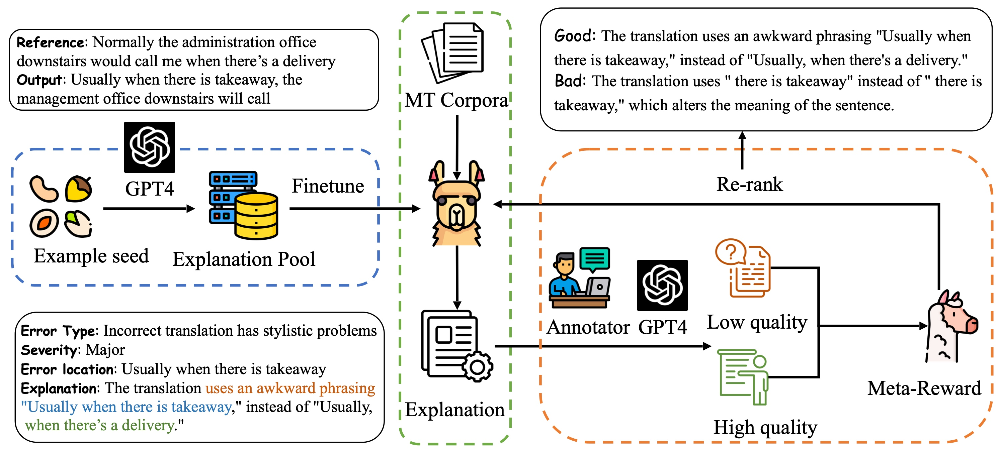

# InstructScore (SEScore3)

An amazing explanation metric (diagnostic report) for text generation evaluation

<div  align="center"> 

</div>

## Installation
We list all required dependencies in requirements.txt. You can create a conda environment and install all dependencies through following commands:

```bash
    conda create -n instructscore python=3.9
    conda activate instructscore
    pip install -r requirements.txt
```

## Usage
There are two ways to use InstructScore.

### Option 1: Have a fast try through Huggingface
We have uploaded our model to Huggingface, which can be found [here](https://huggingface.co/xu1998hz/InstructScore).
You can directly try InstructScore via several lines of code:

```python
from InstructScore import InstructScore

refs = ["Normally the administration office downstairs would call me when there’s a delivery."]
outs = ["Usually when there is takeaway, the management office downstairs will call."]

scorer = InstructScore()
batch_explanations, batch_scores = scorer.score(refs, outs)
```

### Option 2: Download weight from Google Drive

You can also download the checkpoint from this Google Drive [link](https://drive.google.com/drive/folders/1seBqoewWHgu7I_AmZ6FE-_3EcJ3mGWQ2?usp=sharing).





